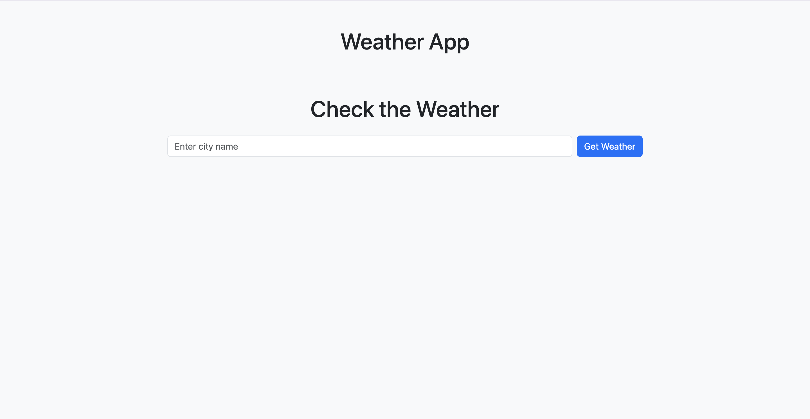
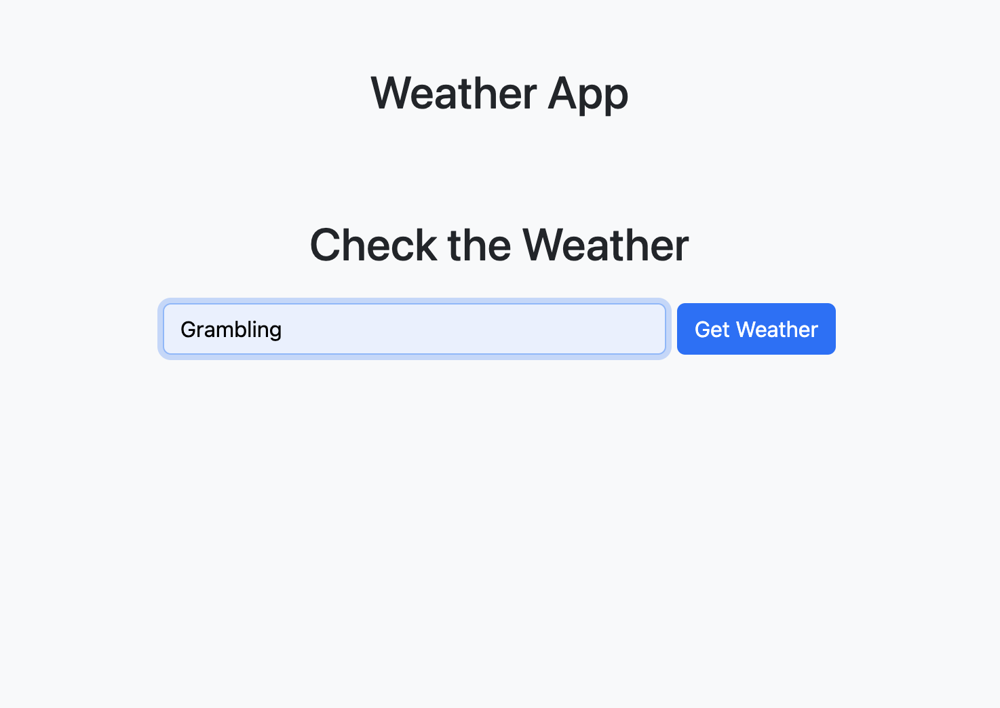
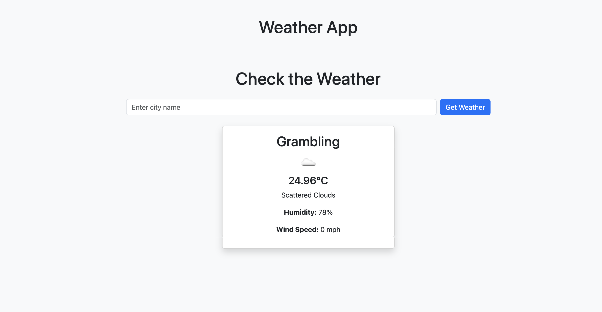

# Enoch's Weather APP
A simple and responsive weather application built with Flask, Bootstrap, and the OpenWeatherMap API. This app allows users to enter a city name and retrieve real-time weather data including temperature, description, humidity, and wind speed.

## Features
- Search weather by city name
- Real time temperature display with **metric** units
- Wind speed and humidity info

### Tech Stack
- Flask
- Bootstrap 5
- OpenWeatherMap API
- requests and python-dotenv

## Pics

## To add
- Geolocation
- Dark mode
- animated icons
